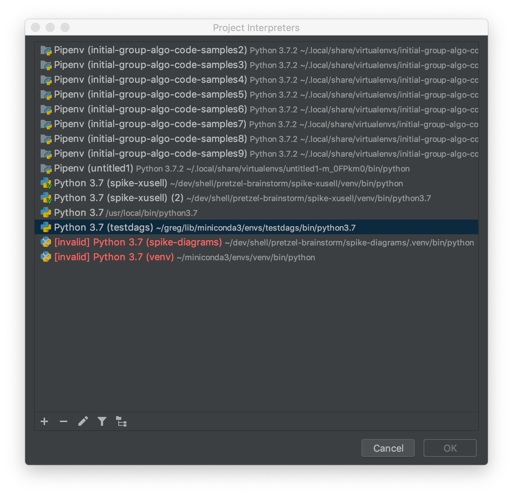

# test-dags-for-k8-airflow

## creating required environment

```bash
conda config --add channels conda-forge
conda create -n testdag python=3.7.3 anaconda pytest pytest-cov sphinx

conda activate testdag
python setup.py develop
pip install -r requirements.txt
```

## Getting Started

### Setting the conda environment

From the project root folder execute the following commands.

```bash
conda activate testdag

mkdir zip_dag_contents
cd zip_dag_contents

git clone https://github.com/apache/incubator-airflow /tmp/airflow-temp
mkdir airflow
cp -r /tmp/airflow-temp/airflow/contrib/ ./airflow/contrib
cp -r /tmp/airflow-temp/airflow/operators ./airflow/operators
cp ../src/test_dags_for_k8_airflow/helloworlddag.py .

zip -rm zip_dag.zip *
mv zip_dag.zip ..
```

In case you would like to add module dependencies to your DAG:
you basically would do the same, but then it is more to use a virtualenv and pip.

### Setting up Pycharm

Follow the basic instructions[here](https://github.com/shellagilehub/pretzel-brainstorm/blob/master/development-workflow/using-git-with-pycharm.md)
then [Setup The Extra Depedencies](#Setup The Extra Depedencies).

### Setup The Extra Dependencies

In Pycharm select Preferences -> Project -> ProjectInterpreter
hit the cog button to the right of Project Interepreter and select "Show All"

Now select the filetree button , hit + to add a new folder.
Select you zip folder from you filesystem, it should be zip_dag.zip if you are following
this guide.




### .airflowignore

A .airflowignore file specifies the directories or files in DAG_FOLDER that Airflow
should intentionally ignore. Each line in .airflowignore specifies a regular expression
pattern, and directories or files whose names (not DAG id) match any of the patterns
would be ignored (under the hood, re.findall() is used to match the pattern). Overall
it works like a .gitignore file.

.airflowignore file should be put in your DAG_FOLDER. For example,
you can prepare a .airflowignore file with contents

```apacheconf
project_a
tenant_[\d]
```
